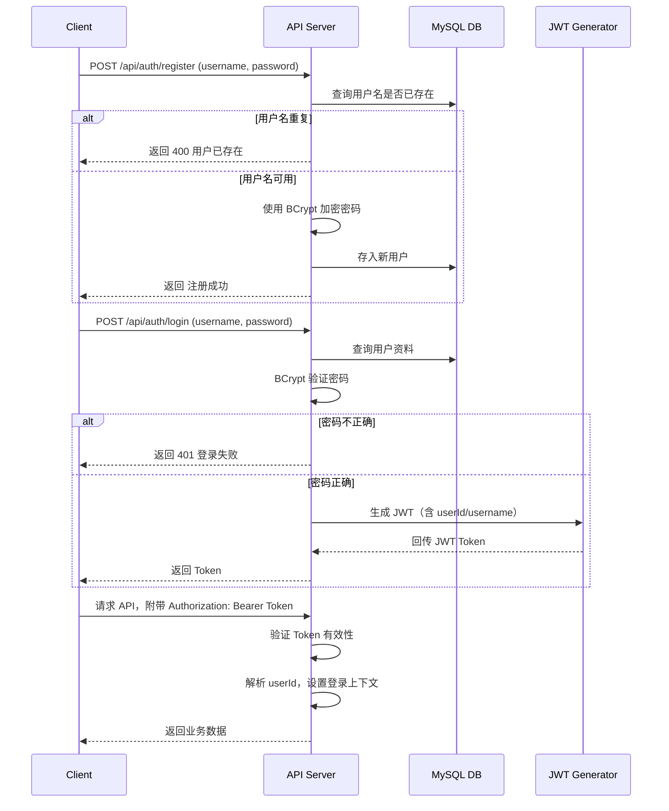

# 用户注册 / 登录 / JWT 身份验证流程

本文件记录了线上预约抢购系统中的使用者认证流程，包含注册、登录、JWT Token 验证的完整过程。

---

## 🔐 身份验证流程图（Mermaid）

## 🧩 流程概览

### 📌 注册流程
- 用户提交用户名与密码
- 检查用户名是否已存在
- 使用 BCryptPasswordEncoder 加密密码
- 保存用户信息至数据库

### 📌 登录流程
- 用户提交用户名与密码
- 验证用户是否存在与密码正确
- 生成 JWT Token，返回给客户端
- 客户端保存 Token（建议存在 LocalStorage）

### 📌 请求认证流程（JWT 验证）
- 所有需要认证的 API，需附上 Authorization: Bearer <token>
- 后端解析 JWT，验证有效性
- 若合法，则将用户信息存入 SecurityContext，允许请求通过

## ✅ 技术关键点

| 项目 | 工具 / 技术 |
|------|--------------|
| 密码加密 | BCryptPasswordEncoder |
| Token 签发 | JWT（Java JWT 或 jjwt） |
| 身份认证流程 | Spring Security + JWT 过滤器 |
| 无状态登录 | 后端不保存 session，全部透过 Token 身份识别 |

## 📁 相关文件路径（待开发）

| 文件 / 类 | 功能说明 |
|-----------|-----------|
| `User.java` | 用户实体类 |
| `UserRepository.java` | JPA Repository |
| `AuthController.java` | 注册与登录的 API |
| `JwtTokenProvider.java` | JWT 生成与验证工具类 |
| `SecurityConfig.java` | Spring Security 配置类 |
| `JwtFilter.java` | 自定义 JWT 过滤器（验证 token 有效性） |