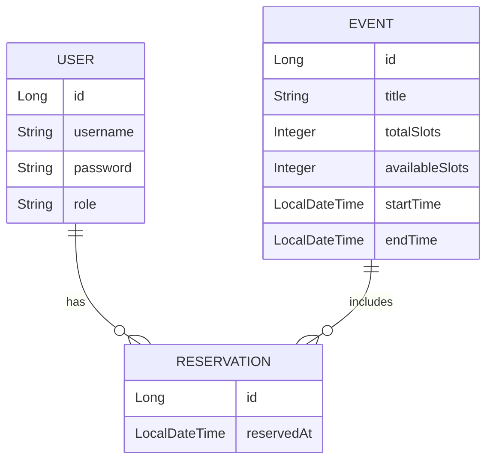

# Database Schema Diagram - 数据库实体关系图
这个图能清楚展示项目中三大主要实体之间的关系：User、Event、Reservation。
在说明预约逻辑、数据模型时尤其关键。

## 实作对照说明：

| 实体类           | 实作路径                            |
| ------------- | ----------------------------------- |
| `User`        | `com.d9.seckill.entity.User`        |
| `Event`       | `com.d9.seckill.entity.Event`       |
| `Reservation` | `com.d9.seckill.entity.Reservation` |

- User 与 Reservation：一对多（用户可以预约多个活动）
- Event 与 Reservation：一对多（一个活动有多个预约）