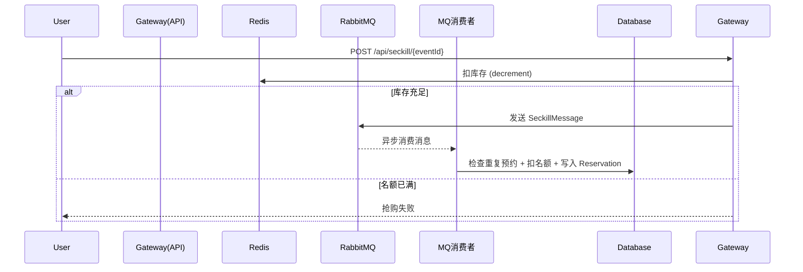

## 高并发流程

```mermaid
sequenceDiagram
    participant User
    participant Gateway(API)
    participant Redis
    participant MQ as RabbitMQ
    participant Worker as MQ消费者
    participant DB as Database

    User->>Gateway: POST /api/seckill/{eventId}
    Gateway->>Redis: 扣库存 (decrement)
    alt 库存充足
        Gateway->>MQ: 发送 SeckillMessage
        MQ-->>Worker: 异步消费消息
        Worker->>DB: 检查重复预约 + 扣名额 + 写入 Reservation
    else 名额已满
        Gateway-->>User: 抢购失败
    end
```
