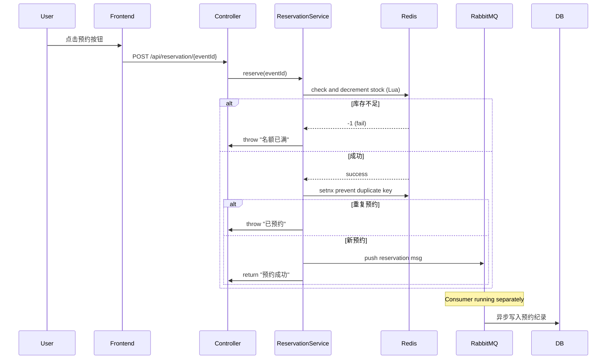

# ⚙️ Seckill Reservation Flow Diagram - 高并发预约流程图

### 此图专注在用户点击「预约」按钮后，系统如何处理请求，确保：
- 防止超卖
- 防止重复预约
- 限流控制
- 并发安全
- 异步入库

## 🔐 流程说明图（Mermaid）

```mermaid
sequenceDiagram
    participant User
    participant Frontend
    participant Controller
    participant ReservationService
    participant Redis
    participant RabbitMQ
    participant DB

    User ->> Frontend: 点击预约按钮
    Frontend ->> Controller: POST /api/reservation/{eventId}
    Controller ->> ReservationService: reserve(eventId)

    ReservationService ->> Redis: check and decrement stock (Lua)
    alt 库存不足
        Redis -->> ReservationService: -1 (fail)
        ReservationService ->> Controller: throw "名额已满"
    else 成功
        Redis -->> ReservationService: success
        ReservationService ->> Redis: setnx prevent duplicate key
        alt 重复预约
            ReservationService ->> Controller: throw "已预约"
        else 新预约
            ReservationService ->> RabbitMQ: push reservation msg
            ReservationService ->> Controller: return "预约成功"
        end
    end

    Note over RabbitMQ: Consumer running separately
    RabbitMQ ->> DB: 异步写入预约纪录
```