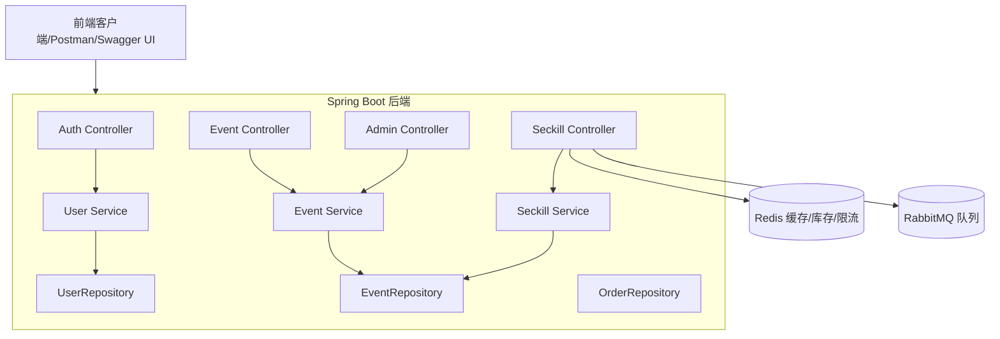

# System Overview - Online Reservation & Seckill System 系统架构总览、组件说明 

本文件为《线上预约抢购系统》的系统总览，目标为展示高并发处理能力的后端作品，适用于简历项目展示与技能实作。

---

## 💼 Project Goals

- 实作一个支持高并发预约 / 抢购操作的后端系统
- 防止超卖、重复预约等问题
- 整合现代后端关键技术：Redis 缓存、分布式锁、限流、异步消息队列、Spring Security、JWT、Docker
- 适用于个人履历项目，可对外展示

---

## 🧱 System Modules Overview

| 模块 | 功能说明 |
|------|----------|
| 👤 使用者模块 (User) | 注册、登录（JWT）、浏览可预约项目、发起预约、查询个人预约纪录 |
| 🛠 管理者模块 (Admin) | 后台登录、创建/编辑预约项目、查看预约总表 |
| 📦 抢购模块 (Seckill) | 提供活动预约接口、库存控制、限流保护、异步排队处理 |
| 🔐 权限与认证模块 | 使用 JWT 实现无状态身份认证，Spring Security 控制接口权限 |
| ⚙️ 基础设施 | Redis（缓存/限流/锁）、RabbitMQ（异步处理）、Swagger（接口文档）、Docker（部署）

---
## 🧩 System Architecture Diagram (Mermaid)

---

## 🔀 Layered Architecture (Spring Boot 分层)

- Controller Layer：接收请求、参数验证
- Service Layer：业务逻辑处理（预约流程、库存控制）
- Repository Layer：使用 Spring Data JPA 处理数据库 CRUD
- Security Layer：JWT 生成、解析与权限验证
- Infrastructure Layer：与 Redis、RabbitMQ 等外部系统整合

---

## ⚙️ High Concurrency Optimization Design
| 技术点 | 用途 | 实作位置说明 |
|--------|------|---------------|
| Redis 缓存库存 | 降低数据库压力，预扣库存 | 抢购前将库存缓存到 Redis，由 Redis 控制递减 |
| 分布式锁 | 控制库存一致性 | 使用 Redis `SETNX` / Redisson 锁住关键操作 |
| 限流器 | 防止恶意刷抢 | 使用 Guava RateLimiter 或 Redis 令牌桶 |
| RabbitMQ 队列 | 异步处理订单入库 | 抢购成功后将请求丢入 MQ，后台消费者处理 DB 写入 |
| JWT 认证 | 用户无状态登录 | 登录后生成 Token，后续请求中验证有效性 |
| Spring Security | 权限控制 | 控制 ADMIN 和 USER 的访问接口范围 |

---

## 👤 用户角色说明
| 角色 | 权限 |
|------|------|
| USER | 注册、登录、浏览项目、发起预约、查看个人预约 |
| ADMIN | 登录、管理活动（CRUD）、查看所有预约纪录 |

---

## 🔗 后续文档链接（待开发）
- auth-flow.md - 注册 / 登录流程
- db-design.md - 数据表与实体结构说明
- seckill-flow.md - 抢购流程与高并发设计细节
