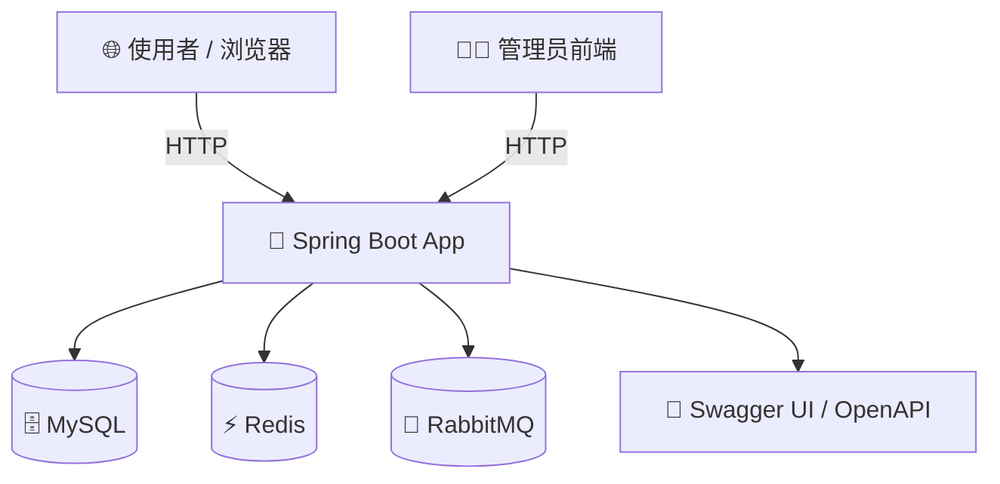

# System Overview - 线上预约抢购系统系统架构总览

本文件为《线上预约抢购系统》的系统总览，目标为展示高并发处理能力的后端作品，适用于简历项目展示与技能实作。

---

## 💼 Project Goals

- 实作一个支持**高并发预约 / 抢购**操作的完整后端系统
- 防止超卖、重复预约等问题
- 整合现代后端关键技术：Redis 缓存、分布式锁、限流、异步消息队列、Spring Security、JWT、Docker 等
- 用于**个人履历项目**展示，强调可运行性与架构完整性

---

## 🧱 System Modules Overview

| 模块 | 功能说明 |
|------|----------|
| 👤 使用者模块 (User) | 注册、登录（JWT）、浏览可预约项目、发起预约、查询个人预约纪录 |
| 🛠 管理者模块 (Admin) | 后台登录、创建/编辑预约项目、分页查看预约纪录 |
| 📦 预约模块 (Reservation) | 提供预约接口、库存控制、限流保护、异步排队处理 |
| 🔐 权限认证模块 | JWT 实现无状态认证，Spring Security 控管接口权限 |
| ⚙️ 系统基础设施 | Redis（缓存/限流/库存锁）、RabbitMQ（异步入库）、Swagger（API Docs）、Docker（部署） |

---

## 🧩 System Architecture Diagram

```mermaid
flowchart TB
    subgraph 前端/客户端
        A1[浏览器 / Postman / Swagger UI]
    end

    subgraph 应用层（Spring Boot）
        A2[AuthController]
        A3[EventController]
        A4[ReservationController]
        A5[AdminController]
    end

    subgraph 业务逻辑层（Service）
        B1[UserService]
        B2[EventService]
        B3[ReservationService]
    end

    subgraph 数据访问层（Repository）
        C1[UserRepository]
        C2[EventRepository]
        C3[ReservationRepository]
    end

    subgraph 外部服务（Infra）
        D1[Redis - 缓存/库存/限流]
        D2[RabbitMQ - 异步队列]
        D3[MySQL - 持久存储]
    end

    A1 --> A2 --> B1 --> C1 --> D3
    A1 --> A3 --> B2 --> C2 --> D3
    A1 --> A4 --> B3 --> C2 & C3 --> D3
    B3 --> D1
    B3 --> D2
```

---

## 🧱 Layered Architecture (Spring Boot 分层)

- Controller Layer：接收 HTTP 请求、验证参数、授权校验
- Service Layer：业务逻辑处理（预约流程、库存判断、异步派送）
- Repository Layer：Spring Data JPA 实作数据库存取
- Security Layer：JWT 登录授权、权限控管
- Infra Layer：与 Redis、RabbitMQ 等组件对接

---

## ⚙️ High Concurrency Optimization Design

| 技术点                  | 说明                 | 实作位置                                   |
| -------------------- | ------------------ | -------------------------------------- |
| Redis 缓存库存           | 降低 DB 访问压力         | 抢购开始前将库存同步至 Redis，Redis 自减控制           |
| 分布式锁                 | 避免超卖               | 使用 Redis / Lua 脚本 / 乐观锁控制并发写入          |
| 限流器                  | 拦截异常请求流量           | 使用 Guava RateLimiter 或 Redis 实作令牌桶     |
| RabbitMQ 异步队列        | 分担写入压力、异步入库        | 用户预约成功后推送请求，消费者异步写入数据库                 |
| JWT 无状态认证            | 提升认证效率与扩展性         | 登录后回传 Token，后续透过 Header 或 Session 验证   |
| Spring Security 权限控管 | 区分 USER / ADMIN 权限 | Controller 接口使用 `@PreAuthorize` 限制权限访问 |

---

## 🌐 Deployment Architecture（部署架构图）



### 💡 简化本地开发架构（非容器）也可用以下文字补充：
- 使用者透过浏览器或 Postman 呼叫 Spring Boot 后端服务
- 后端透过 JDBC 连线至本地 MySQL
- Redis 提供库存缓存与限流功能
- RabbitMQ 处理高并发预约请求的异步队列
- Swagger 提供 API 文档查看与测试
- 前端使用 Thymeleaf 或 React 串接后端接口

---

## 👤 用户角色说明

| 角色    | 权限说明               |
| ----- | ------------------ |
| USER  | 浏览活动、预约活动、查看我的预约   |
| ADMIN | 管理活动、查看预约纪录、后台权限操作 |


---

## 🔗 相关文档

| 主题            | 文件                                              |
| ------------- | ----------------------------------------------- |
| 🔐 身份验证流程     | [`docs/auth-flow.md`](auth-flow.md)             |
| 🧱 系统架构说明     | [`docs/system-overview.md`](system-overview.md) |
| 🗃 数据库设计      | [`docs/db-design.md`](db-design.md)             |
| ⚙️ 抢购流程与高并发优化 | [`docs/seckill-flow.md`](seckill-flow.md)       |


---

✅ 实作状态对照

| 模块                     | 状态    | 说明                                    |
| ---------------------- | ----- | ------------------------------------- |
| User 模块                | ✅ 已完成 | 注册 / 登录 / JWT 登录测试                    |
| Event 模块               | ✅ 已完成 | CRUD + 后台分页查看                         |
| Reservation 模块         | ✅ 已完成 | 包含重复预约判断、库存判断、分页管理接口                  |
| Redis 优化               | ✅ 已完成 | Lua 脚本库存扣减、防重复预约 Key 设计               |
| RabbitMQ               | ✅ 已完成 | 队列发送端与消费端测试通过                         |
| 前端页面                   | ✅ 已完成 | Thymeleaf 页面展示，登录与预约可操作               |
| 单元测试                   | ✅ 已完成 | 各 Service / Controller 层均已覆盖          |
| 测试配置                   | ✅ 已完成 | 使用 H2 + `application-test.yml`        |
| 安全配置（test）             | ✅ 已完成 | Profile `test` 安全策略覆盖                 |
| GlobalExceptionHandler | ✅ 已完成 | RuntimeException 捕获并输出 ResponseEntity |
